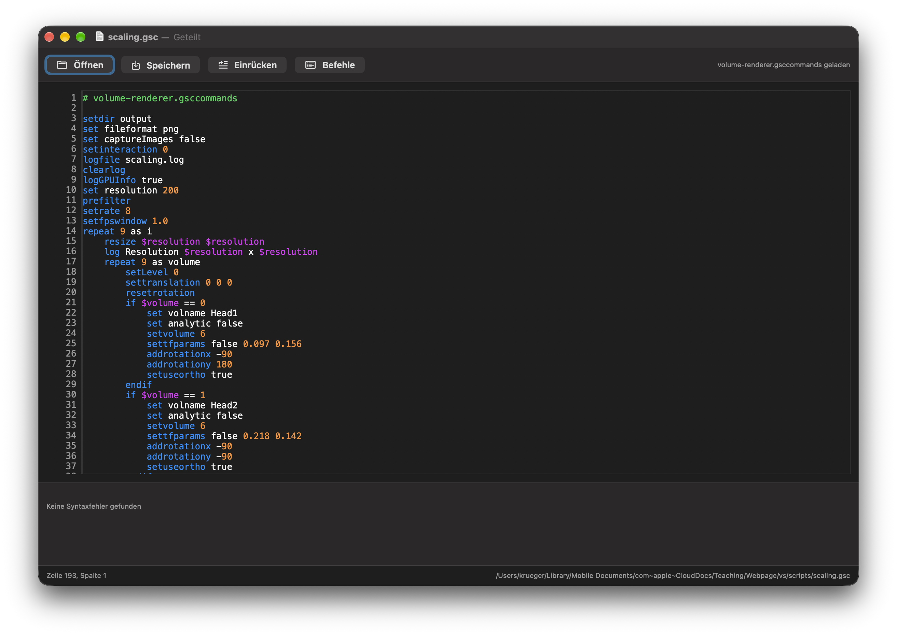

# Graphics Script Editor

Native macOS editor for `Graphics Script` files with live validation and structure-aware indentation.

## Overview

`Graphics Script Editor` is a dedicated script editor for `.gsc` files. It is used to write scripts for the application presented in the paper *"Reassessing Quality, Performance, and Reproducibility of Higher-Order Filtering and Virtual Samples in Volume Rendering"*. The editor is built for the workflow of writing and checking those graphics scripts quickly, without forcing that work into a general-purpose text editor.

The app combines a native editing experience with just enough IDE behavior to be useful:

- live syntax diagnostics
- script-aware indentation
- smart block pasting
- configurable appearance

## Features

### Editing

- Native macOS editor for `.gsc` files
- Open, save, and save-as with `gsc` as the default extension
- Line numbers and cursor position display
- Configurable font, font size, indentation style, and syntax colors
- Optional autosave

### Structure Awareness

- Block-aware indentation for:
  - `if`
  - `else`
  - `endif`
  - `repeat`
  - `endrepeat`
- Paste behavior that reindents pasted blocks to the current code context
- Indentation correction command for normalizing existing scripts

### Validation

- Live syntax checking while editing
- Diagnostics with line-numbered error reporting
- Validation powered by the built-in command interpreter in validation mode
- Optional external command definition files for application-specific commands

### Command Definitions

The editor always knows the base graphics-script DSL and base tool commands.
Application-specific commands can be loaded from a human-readable `.gsccommands`
file. Each non-empty line defines one signature:

```text
commandName(type, type)
commandWithNoArguments()
matrixCommand(float * 16)
input(string) -> string
```

Supported argument types are `int`, `int64`, `uint32`, `bool`, `float`,
`double`, `string`, and `restString`. Use repeated lines for overloads. Lines
can contain `#` comments. A definition without `->` is an ordinary command.
A definition with `-> returnType` is a value-returning function that can be
used on the right-hand side of `set`:

```text
input(string) -> string
fileinput(string) -> string
dirinput(string) -> string
```

With those definitions loaded, these script lines are valid:

```text
set name input "Enter your name"
set file fileinput "Select a file"
set directory dirinput "Select a directory"
```

Single- and double-quoted script arguments can contain whitespace. Function
overloads are declared by repeating the function name with another signature.

Load a definition file with the `Commands` toolbar button, or put a path in the
first script comment:

```text
# CommandDefinitions/volume-renderer.gsccommands
```

Relative paths are resolved next to the script file. The sample volume-renderer
definitions live in `CommandDefinitions/volume-renderer.gsccommands`. In a
sandboxed build, the editor asks for access with a file dialog already pointed
at the referenced definition file and remembers the approval for future use.

### macOS Integration

- Registers `.gsc` as a dedicated document type
- Supports opening files directly from Finder
- Restores open file-backed tabs on launch when enabled
- Tracks recent files

## File Type

The project exports this Uniform Type Identifier:

- UTI: `de.cgvis.graphicsscript`
- Extension: `.gsc`
- Conforms to: `public.plain-text`

## Build Requirements

- macOS 13+
- Xcode 16+ recommended

## Getting Started

1. Open `GraphicsScriptEditor.xcodeproj` in Xcode.
2. Build and run the `Graphics Script Editor` target.
3. Open or create a `.gsc` file and start editing.

## Typical Workflow

1. Double-click a `.gsc` file in Finder or open one from inside the app.
2. Edit the script with live syntax highlighting and diagnostics.
3. Use the built-in indentation support to keep block structure clean.

## Screenshots


